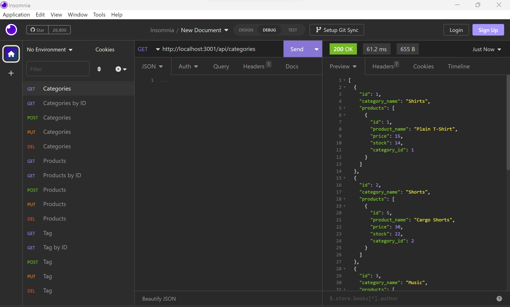

# E-commerce Back End

## Description

This application code demonstrates the back end interface between NODE JS and SQL database through the use of Object Relational Mapping(ORM). This application uses Sequalize library to create models and Express to respond to API requests.

## How to run the application

#### Prerequisites:
- Node JS
- MYSQL server
- API Client software (Insomnia or Postman)

#### Steps:

1) Clone this repository to your machine by typing `git@github.com:zafarfast/yt542998782.git` on the terminal.
2) Install all dependencies by typing `npm install`.
3) Initialize SQL server by typing `mysql -u <username> -p<password>`.
4) Go to .\db directory and run schema.sql `source schema.sql`.
5) Change MySQL username and password in Connection.js file or .env file to match your credentials.
6) Run the application by typing `node servre.js` in the terminal.

## Links

Github: https://github.com/zafarfast/yt542998782

Screenshare: https://watch.screencastify.com/v/DjGS2H4JwgmUUpHBBVR3

## Screenshots

